# UML Activity Diagram - Lavage Auto Booking Process

```mermaid
flowchart TD
    Start([Customer wants car wash]) --> Auth{Is customer logged in?}
    
    Auth -->|No| Login[Login/Register]
    Login --> SelectService[Select service type]
    Auth -->|Yes| SelectService
    
    SelectService --> ServiceOptions{Service Type}
    ServiceOptions -->|Exterior| PriceExt[€15 - Exterior wash]
    ServiceOptions -->|Complete| PriceComp[€25 - Complete wash]
    ServiceOptions -->|Premium| PricePrem[€35 - Premium wash]
    
    PriceExt --> SelectCar[Select car]
    PriceComp --> SelectCar
    PricePrem --> SelectCar
    
    SelectCar --> HasCar{Has registered car?}
    HasCar -->|No| AddCar[Add car information]
    AddCar --> ChooseCar[Choose car for service]
    HasCar -->|Yes| ChooseCar
    
    ChooseCar --> SelectDate[Select preferred date]
    SelectDate --> CheckAvailability{Check time slots}
    CheckAvailability -->|No slots| SelectAltDate[Select alternative date]
    SelectAltDate --> CheckAvailability
    CheckAvailability -->|Slots available| SelectTime[Select time slot]
    
    SelectTime --> EnterAddress[Enter service address]
    EnterAddress --> ReviewBooking[Review booking details]
    
    ReviewBooking --> ConfirmDetails{Details correct?}
    ConfirmDetails -->|No| ModifyBooking[Modify booking]
    ModifyBooking --> ReviewBooking
    ConfirmDetails -->|Yes| ProcessPayment[Process payment]
    
    ProcessPayment --> PaymentResult{Payment successful?}
    PaymentResult -->|Failed| PaymentError[Show payment error]
    PaymentError --> ProcessPayment
    PaymentResult -->|Success| BookingConfirmed[Booking confirmed]
    
    BookingConfirmed --> SendConfirmation[Send confirmation email/SMS]
    SendConfirmation --> WaitForService[Wait for scheduled date]
    
    WaitForService --> ServiceDay{Service day arrives}
    ServiceDay --> WasherNotified[Washer receives assignment]
    WasherNotified --> WasherArrives[Washer arrives at location]
    
    WasherArrives --> ServiceStarted[Service started notification]
    ServiceStarted --> PerformService[Washer performs car wash]
    PerformService --> TakePhotos[Take before/after photos]
    TakePhotos --> ServiceCompleted[Mark service as completed]
    
    ServiceCompleted --> SendCompletion[Send completion notification]
    SendCompletion --> CustomerReview{Customer wants to review?}
    CustomerReview -->|Yes| SubmitReview[Submit rating and review]
    CustomerReview -->|No| End([Process completed])
    SubmitReview --> End
    
    %% Parallel processes
    BookingConfirmed --> ScheduleReminder[Schedule reminder notifications]
    ScheduleReminder --> SendReminder[Send reminder 24h before]
    SendReminder -.-> ServiceDay
    
    %% Error handling
    ProcessPayment --> PaymentTimeout{Payment timeout?}
    PaymentTimeout -->|Yes| CancelBooking[Cancel booking]
    CancelBooking --> NotifyCustomer[Notify customer of cancellation]
    NotifyCustomer --> End
    
    %% Customer cancellation flow
    WaitForService --> CustomerCancel{Customer cancels?}
    CustomerCancel -->|Yes| RefundPayment[Process refund]
    RefundPayment --> CancelNotification[Send cancellation confirmation]
    CancelNotification --> End
    CustomerCancel -->|No| ServiceDay

    %% Styling
    classDef startEnd fill:#e8f5e8,stroke:#4caf50,stroke-width:3px
    classDef process fill:#e3f2fd,stroke:#2196f3,stroke-width:2px
    classDef decision fill:#fff3e0,stroke:#ff9800,stroke-width:2px
    classDef error fill:#ffebee,stroke:#f44336,stroke-width:2px
    classDef success fill:#e8f5e8,stroke:#4caf50,stroke-width:2px
    
    class Start,End startEnd
    class Login,SelectService,SelectCar,AddCar,SelectDate,SelectTime,EnterAddress,ReviewBooking,ProcessPayment,BookingConfirmed,SendConfirmation,WasherArrives,ServiceStarted,PerformService,ServiceCompleted,SendCompletion,SubmitReview,ScheduleReminder,SendReminder process
    class Auth,ServiceOptions,HasCar,CheckAvailability,ConfirmDetails,PaymentResult,ServiceDay,CustomerReview,PaymentTimeout,CustomerCancel decision
    class PaymentError,CancelBooking,NotifyCustomer,RefundPayment,CancelNotification error
    class WasherNotified,TakePhotos success
```

## Booking Process States

### Customer States
1. **Anonymous** → **Authenticated** → **Service Selection**
2. **Service Selection** → **Car Selection** → **Scheduling**
3. **Scheduling** → **Payment** → **Confirmed**
4. **Confirmed** → **Waiting** → **In Service** → **Completed**

### Booking States in Database
- `pending` - Initial booking created, payment processing
- `confirmed` - Payment successful, service scheduled
- `assigned` - Washer assigned to booking
- `in_progress` - Service actively being performed
- `completed` - Service finished successfully
- `cancelled` - Booking cancelled by customer or system
- `refunded` - Payment refunded after cancellation

### Decision Points

#### Critical Decision Points
1. **Authentication Check**: Determines if customer needs to login
2. **Car Registration**: New customers must add vehicle information
3. **Time Slot Availability**: Prevents double-booking conflicts
4. **Payment Processing**: Must succeed for booking confirmation
5. **Service Day Arrival**: Triggers washer assignment and customer notifications

#### Business Rules
- Bookings must be made at least 2 hours in advance
- Payment is required before booking confirmation
- Customers can cancel up to 1 hour before scheduled time
- Washers must upload completion photos
- Refunds are processed for valid cancellations

### Parallel Processes
- **Reminder System**: Runs independently to send notifications
- **Washer Assignment**: Automated matching based on location and availability
- **Photo Upload**: Optional but encouraged for service quality

### Error Handling
- Payment failures trigger retry mechanisms
- Booking conflicts redirect to alternative time selection
- System timeouts result in automatic cancellation with notifications

This activity diagram shows the complete customer journey from initial service interest through final completion, including all major decision points, parallel processes, and error scenarios.