# UML Component Diagram - Lavage Auto System Architecture

```mermaid
graph TB
    %% Frontend Layer
    subgraph "Frontend Layer (Next.js)"
        subgraph "Pages"
            HomePage[🏠 Home Page]
            LoginPage[🔐 Login Page]
            BookingPage[📅 Booking Page]
            ProfilePage[👤 Profile Page]
            ContactPage[📞 Contact Page]
        end
        
        subgraph "Components"
            Header[📋 Header Component]
            AuthForm[🔑 Auth Forms]
            BookingForm[📝 Booking Form]
            CarForm[🚗 Car Form]
        end
        
        subgraph "Context"
            AuthContext[🔐 Auth Context]
        end
        
        subgraph "Utilities"
            SupabaseClient[📡 Supabase Client]
        end
    end

    %% API Layer
    subgraph "API Layer (Next.js App Router)"
        subgraph "Auth APIs"
            AuthLogin[POST /api/auth/login]
            AuthRegister[POST /api/auth/register]
            AuthCallback[GET /auth/callback]
        end
        
        subgraph "Customer APIs"
            CustomerProfile[GET/PUT /api/customer/profile]
            CustomerCars[GET/POST /api/customer/cars]
        end
        
        subgraph "Booking APIs"
            BookingCreate[POST /api/bookings]
            BookingList[GET /api/bookings]
            BookingUpdate[PUT /api/bookings/:id]
        end
        
        subgraph "Service APIs"
            ServicePricing[GET /api/services/pricing]
            ServiceAvailability[GET /api/services/availability]
        end
    end

    %% Business Logic Layer
    subgraph "Business Logic Layer"
        subgraph "Services"
            AuthService[🔐 Authentication Service]
            BookingService[📅 Booking Service]
            NotificationService[📬 Notification Service]
            PaymentService[💳 Payment Service]
            ValidationService[✅ Validation Service]
        end
        
        subgraph "Utilities"
            AuthUtils[🔑 Auth Utils]
            PrismaClient[🗃️ Prisma Client]
        end
    end

    %% Data Layer
    subgraph "Data Layer"
        subgraph "Database (Supabase PostgreSQL)"
            CustomerTable[(👥 customers)]
            CarTable[(🚗 cars)]
            BookingTable[(📅 bookings)]
        end
        
        subgraph "External Services"
            SupabaseAuth[🔐 Supabase Auth]
            GoogleOAuth[🔍 Google OAuth]
            EmailService[📧 Email Service]
            SMSService[📱 SMS Service]
        end
    end

    %% Connections - Frontend to API
    HomePage --> AuthCallback
    LoginPage --> AuthLogin
    LoginPage --> AuthRegister
    BookingPage --> BookingCreate
    BookingPage --> ServicePricing
    BookingPage --> ServiceAvailability
    ProfilePage --> CustomerProfile
    ProfilePage --> CustomerCars

    %% Context and Client connections
    AuthContext --> SupabaseClient
    SupabaseClient --> SupabaseAuth
    SupabaseClient --> GoogleOAuth

    %% API to Business Logic
    AuthLogin --> AuthService
    AuthRegister --> AuthService
    CustomerProfile --> AuthService
    CustomerCars --> AuthService
    BookingCreate --> BookingService
    BookingCreate --> PaymentService
    BookingList --> BookingService
    BookingUpdate --> BookingService
    
    %% Business Logic to Data
    AuthService --> PrismaClient
    BookingService --> PrismaClient
    AuthService --> AuthUtils
    BookingService --> NotificationService
    NotificationService --> EmailService
    NotificationService --> SMSService
    PaymentService --> ExternalPayment[💰 Payment Gateway]

    %% Prisma to Database
    PrismaClient --> CustomerTable
    PrismaClient --> CarTable
    PrismaClient --> BookingTable

    %% Styling
    classDef frontend fill:#e1f5fe
    classDef api fill:#f3e5f5
    classDef business fill:#e8f5e8
    classDef data fill:#fff3e0
    classDef external fill:#ffebee

    class HomePage,LoginPage,BookingPage,ProfilePage,ContactPage,Header,AuthForm,BookingForm,CarForm,AuthContext,SupabaseClient frontend
    class AuthLogin,AuthRegister,AuthCallback,CustomerProfile,CustomerCars,BookingCreate,BookingList,BookingUpdate,ServicePricing,ServiceAvailability api
    class AuthService,BookingService,NotificationService,PaymentService,ValidationService,AuthUtils,PrismaClient business
    class CustomerTable,CarTable,BookingTable data
    class SupabaseAuth,GoogleOAuth,EmailService,SMSService,ExternalPayment external
```

## Component Descriptions

### Frontend Layer (Next.js)

#### Pages
- **Home Page**: Landing page with service information and navigation
- **Login Page**: Authentication interface supporting email/password and Google OAuth
- **Booking Page**: Service booking interface with car selection and scheduling
- **Profile Page**: User profile management and car information
- **Contact Page**: Contact information and support

#### Components
- **Header Component**: Navigation and user authentication status
- **Auth Forms**: Reusable login/registration forms
- **Booking Form**: Multi-step booking creation interface
- **Car Form**: Vehicle information input and management

#### Context & Utilities
- **Auth Context**: Global authentication state management
- **Supabase Client**: Frontend client for Supabase services

### API Layer (Next.js App Router)

#### Authentication APIs
- **POST /api/auth/login**: Email/password authentication
- **POST /api/auth/register**: New account creation
- **GET /auth/callback**: OAuth callback handling

#### Customer APIs
- **GET/PUT /api/customer/profile**: Profile data management
- **GET/POST /api/customer/cars**: Vehicle information management

#### Booking APIs
- **POST /api/bookings**: New booking creation
- **GET /api/bookings**: Booking history and status
- **PUT /api/bookings/:id**: Booking modifications

#### Service APIs
- **GET /api/services/pricing**: Dynamic pricing information
- **GET /api/services/availability**: Time slot availability

### Business Logic Layer

#### Core Services
- **Authentication Service**: User authentication and session management
- **Booking Service**: Booking logic, validation, and scheduling
- **Notification Service**: Email/SMS communication management
- **Payment Service**: Payment processing and transaction handling
- **Validation Service**: Input validation and business rule enforcement

#### Utilities
- **Auth Utils**: Password hashing, token management
- **Prisma Client**: Type-safe database access layer

### Data Layer

#### Database Tables
- **customers**: User account and profile information
- **cars**: Vehicle details and ownership
- **bookings**: Service appointments and status

#### External Services
- **Supabase Auth**: Authentication provider
- **Google OAuth**: Social login integration
- **Email Service**: Transactional email delivery
- **SMS Service**: Text message notifications
- **Payment Gateway**: External payment processing

## Architecture Principles

### Separation of Concerns
- Clear boundaries between presentation, business, and data layers
- Each component has a single, well-defined responsibility

### Scalability
- Stateless API design enables horizontal scaling
- Database connection pooling optimizes resource usage
- External services reduce system complexity

### Security
- Authentication handled by proven external providers
- Sensitive operations isolated in business logic layer
- Input validation at multiple layers

### Maintainability
- Type-safe database access with Prisma
- Modular component structure
- Clear API contracts between layers