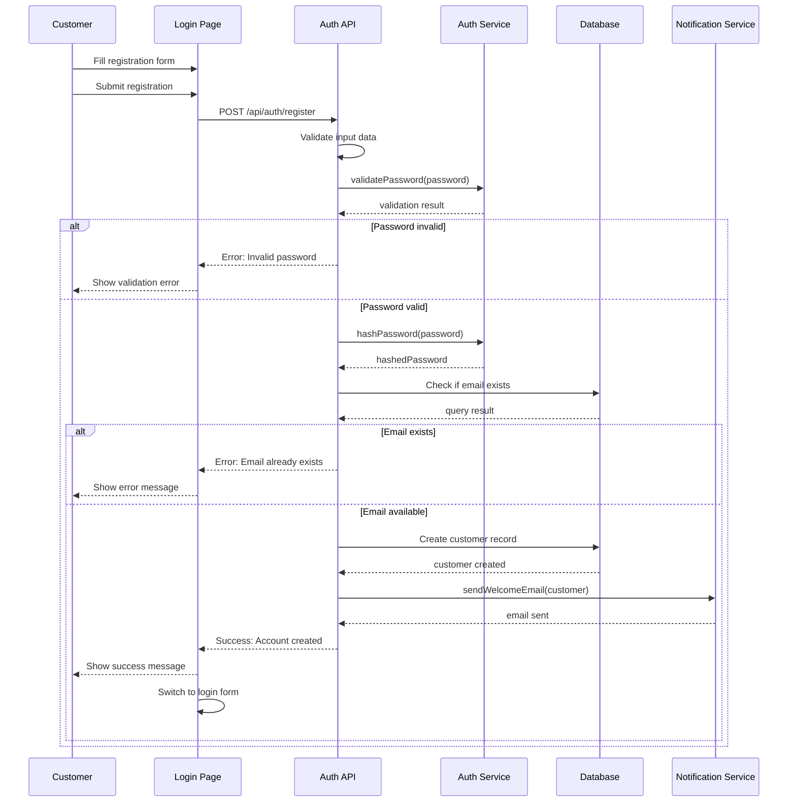
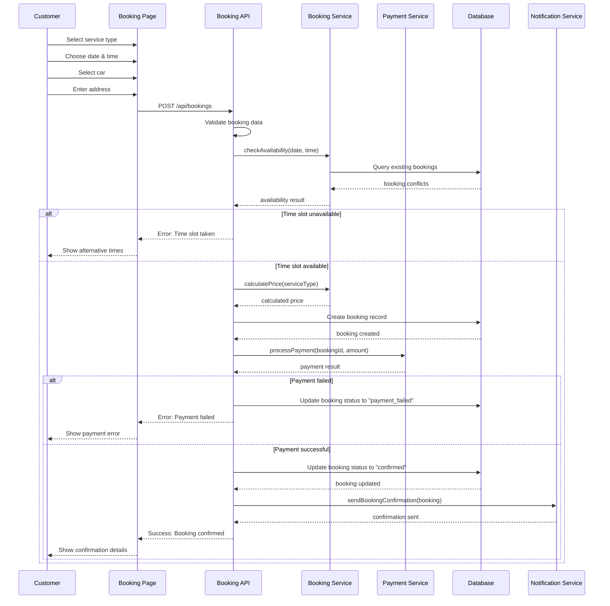
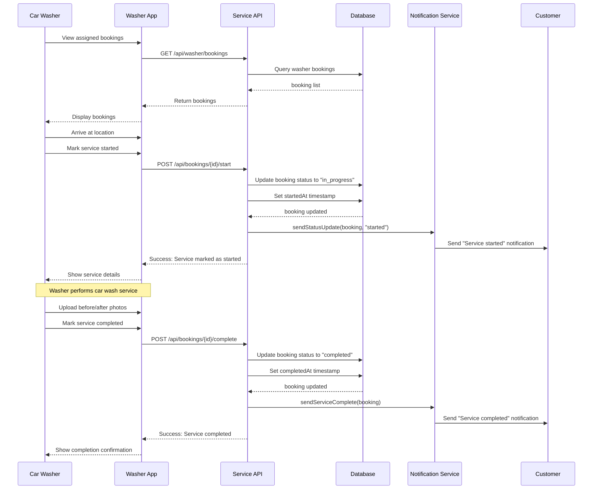
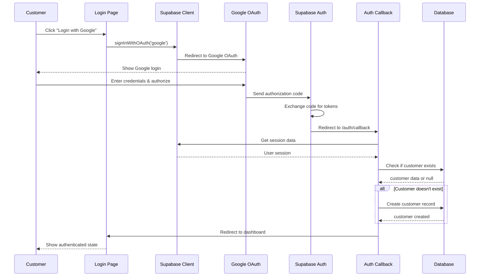

# UML Sequence Diagrams - Lavage Auto System

## 1. Customer Registration Sequence

## 2. Booking Creation Sequence

## 3. Service Execution Sequence

## 4. Authentication Flow (OAuth)

## Key Sequence Insights

### Error Handling Patterns
- Input validation occurs before database operations
- Payment failures trigger booking status updates
- Failed operations provide specific error messages

### Notification Patterns
- Notifications are sent after successful database updates
- Multiple notification types (email, SMS, push) can be triggered
- Customers receive updates at key booking milestones

### Security Patterns
- Password hashing occurs before database storage
- OAuth flows redirect through secure callbacks
- Session validation occurs on protected endpoints

### Performance Considerations
- Availability checks prevent double-bookings
- Database queries are optimized for common operations
- Notifications are sent asynchronously when possible