# UML Use Case Diagram - Lavage Auto System

```mermaid
graph TB
    %% Actors
    Customer((Customer))
    Washer((Car Washer))
    Admin((Administrator))
    System((Payment System))
    
    %% Use Cases - Authentication
    subgraph "Authentication System"
        UC1[Register Account]
        UC2[Login with Email/Password]
        UC3[Login with Google OAuth]
        UC4[Reset Password]
        UC5[Verify Email]
    end
    
    %% Use Cases - Profile Management
    subgraph "Profile Management"
        UC6[Update Profile]
        UC7[Add Car Information]
        UC8[Edit Car Details]
        UC9[Remove Car]
        UC10[View Profile]
    end
    
    %% Use Cases - Booking System
    subgraph "Booking System"
        UC11[Create Booking]
        UC12[View Available Slots]
        UC13[Select Service Type]
        UC14[Cancel Booking]
        UC15[Reschedule Booking]
        UC16[View Booking History]
        UC17[Confirm Booking]
    end
    
    %% Use Cases - Service Execution
    subgraph "Service Execution"
        UC18[Mark Service Started]
        UC19[Update Service Progress]
        UC20[Complete Service]
        UC21[Upload Before/After Photos]
        UC22[Rate Service]
    end
    
    %% Use Cases - Payment
    subgraph "Payment System"
        UC23[Process Payment]
        UC24[Generate Invoice]
        UC25[Refund Payment]
    end
    
    %% Use Cases - Notifications
    subgraph "Notification System"
        UC26[Send Booking Confirmation]
        UC27[Send Service Reminder]
        UC28[Send Status Updates]
        UC29[Send Service Completion]
    end
    
    %% Use Cases - Administration
    subgraph "Administration"
        UC30[Manage Service Pricing]
        UC31[View All Bookings]
        UC32[Generate Reports]
        UC33[Manage Car Washers]
        UC34[Handle Customer Support]
    end
    
    %% Customer Relationships
    Customer --- UC1
    Customer --- UC2
    Customer --- UC3
    Customer --- UC4
    Customer --- UC6
    Customer --- UC7
    Customer --- UC8
    Customer --- UC9
    Customer --- UC10
    Customer --- UC11
    Customer --- UC12
    Customer --- UC13
    Customer --- UC14
    Customer --- UC15
    Customer --- UC16
    Customer --- UC22
    
    %% Car Washer Relationships
    Washer --- UC18
    Washer --- UC19
    Washer --- UC20
    Washer --- UC21
    
    %% Admin Relationships
    Admin --- UC30
    Admin --- UC31
    Admin --- UC32
    Admin --- UC33
    Admin --- UC34
    Admin --- UC17
    Admin --- UC25
    
    %% System Relationships
    System --- UC23
    System --- UC24
    System --- UC26
    System --- UC27
    System --- UC28
    System --- UC29
    
    %% Include Relationships
    UC11 -.->|includes| UC12
    UC11 -.->|includes| UC13
    UC11 -.->|includes| UC23
    UC17 -.->|includes| UC26
    UC18 -.->|includes| UC28
    UC20 -.->|includes| UC29
    UC20 -.->|includes| UC24
    
    %% Extend Relationships
    UC5 -.->|extends| UC1
    UC4 -.->|extends| UC2
```

## Use Case Descriptions

### Primary Use Cases

#### Customer Use Cases
- **UC1 - Register Account**: New customer creates account with email/password or Google OAuth
- **UC11 - Create Booking**: Customer books a car wash service by selecting date, time, service type, and car
- **UC16 - View Booking History**: Customer reviews past and upcoming bookings
- **UC22 - Rate Service**: Customer provides feedback after service completion

#### Car Washer Use Cases
- **UC18 - Mark Service Started**: Washer indicates they've arrived and started the service
- **UC20 - Complete Service**: Washer marks service as finished and uploads completion photos
- **UC21 - Upload Before/After Photos**: Documentation of the service performed

#### System Use Cases
- **UC23 - Process Payment**: Automated payment processing when booking is confirmed
- **UC26 - Send Booking Confirmation**: Automatic email/SMS confirmation to customer

### Use Case Priorities

**High Priority** (MVP):
- Authentication (UC1, UC2, UC3)
- Basic Booking (UC11, UC12, UC13, UC17)
- Service Execution (UC18, UC20)
- Payment Processing (UC23, UC24)

**Medium Priority**:
- Profile Management (UC6-UC10)
- Booking Management (UC14, UC15, UC16)
- Notifications (UC26-UC29)

**Low Priority** (Future Features):
- Rating System (UC22)
- Photo Upload (UC21)
- Advanced Administration (UC30-UC34)